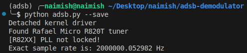
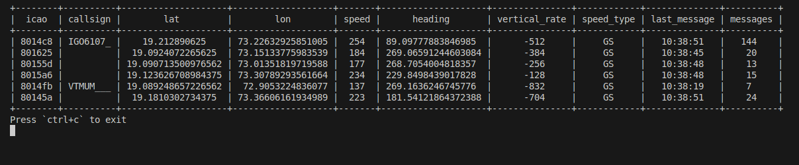

# adsb-demodulator
ADSB demodulator written in python

## Dependancies
- You'll need an RTL-SDR (for obvious reasons)
- You'll need to have the RTL-SDR drivers installed

## Running Instructions
1. Create a virtual environment
2. Install the dependancies from `requirements.txt`
3. Run `python adsb.py` to run the live demodulator

Note : You can also run `python adsb.py --save` to save the message dump to `dump.p`.

## Sample Screenshots

### Running Command

### Sample Output

## Notes

SoapySDR was installed on the device, not in the venv. Expose it by setting
`include-system-site-packages = true`
in `pyvenv.cfg`.

Turns out SoapySDR isn't working as good as rtlsdr for this. Idk why. Will check it out later.

Code filled up from [here](https://web.archive.org/web/20210215153143/https://inst.eecs.berkeley.edu/~ee123/sp16/lab/lab2/lab2-TimeDomain-SDR.html)